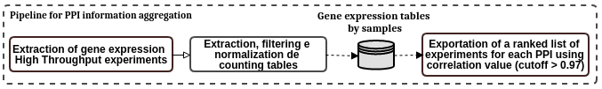

# PipePatExp - Pipeline to aggregate gene expression correlation information for PPI

Pipeline that uses information of high throughput gene expression experiments publicly available on [GEO](https://www.ncbi.nlm.nih.gov/geo/) to find those where the proteins involved in protein interactions appear high correlated to each other with a cut-of value > 0.97.

## Summary

The PPI information aggregation pipeline starts getting all the datasets in [GEO](https://www.ncbi.nlm.nih.gov/geo/) database whose material was generated using expression profiling by high throughput sequencing. From each database identifiers, it extracts the supplementary files that had the counts table. Once finishing the download step, it identifies those that were normalized or had the raw counts to normalize.  It also identify and map the gene ids to uniprot (the ids found usually were from HGNC and Ensembl). For each normalized counts table belonging to some experiment, il filters those which have the proteins (already mapped from HGNC to Uniprot identifiers) in the pairs in evaluation. Then, it calculates the correlation matrix based on Pearson method in the tables and saves the respective pairs correlation value for each table. Finally, a repor is made for each pair in descending order of correlation value with the experiment identifiers.

The figure below illustrates all the tasks of this pipeline.

<div style="text-align: center">
	
</div>

## Requirements:
* Python packages needed:
	- os
	- scipy
	- pandas
	- sklearn
	- Bio python
	- numpy

## Usage Instructions
* Preparation:
	1. ````git clone https://github.com/YasCoMa/PipeAggregationInfo.git````
	2. ````cd PipeAggregationInfo````
	3. ````pip3 install -r requirements.txt````

### Preprocessing pipeline
* Go to the ncbi [GDS database webpage](https://www.ncbi.nlm.nih.gov/gds), use the key words to filter your gds datasets of interest and save the results as file ("Send to" option), and choose "Summary (text)"
* Alternatively, we already saved the results concerning protein interactions, you may use them to run preprocessing in order to obtain the necessary files for the main pipeline
* Running preprocessing:
    - ````cd preprocessing````
    - ````python3 data_preprocessing.py ./workdir_preprocessing filter_files````
    - ````cd ../````
    - Copy the generated output folder "data_matrices_count" into the workflow folder: ````cp -R preprocessing/workdir_preprocessing/data_matrices_count .````

### Main pipeline

* Pipeline parameters:
	- __-rt__ or __--running_type__ <br>
		Use to indicate the step you want to execute (it is desirable following the order): <br>
		1 - Make the process of finding the experiments and ranking them by correlation <br>
		2 - Select pairs that were already processed and ranked making a separated folder of interest

	- __-fo__ or __--folder__ <br>
		Folder to store the files (use the folder where the other required file can be found)
	
	- __-if__ or __--interactome_file__ <br>
		File with the pairs (two columns with uniprot identifiers in tsv format)<br>
		
		Example of this file: running_example/all_pairs.tsv

	- __-spf__ or __--selected_pairs_file__ <br>
		File with PPIs of interest (two columns with uniprot identifiers in tsv format)<br>
		
		Example of this file: running_example/selected_pairs.tsv

* Running modes examples:
	1. Run step 1: <br>
	````python3 pipeline_expression_pattern.py -rt 1 -fo running_example/ -if all_pairs.tsv ````

	2. Run step 2: <br>
	````python3 pipeline_expression_pattern.py -rt 2 -fo running_example/ -spf selected_pairs.tsv ````

## Reference

## Bug Report
Please, use the [Issue](https://github.com/YasCoMa/PipeAggregationInfo/issues) tab to report any bug.
